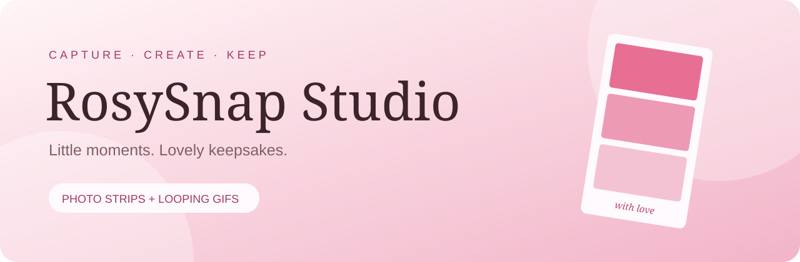
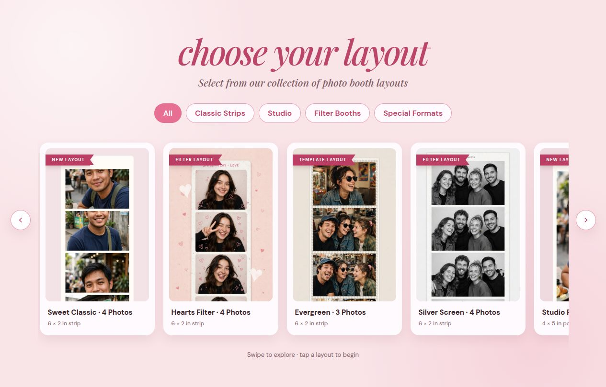

<p align="center">
  
</p>

<p align="center">
  <a href="https://rosysnap-studio.vercel.app"></a>
  
  
</p>

<p align="center"><strong>Your browser becomes a little photo studio.</strong><br />Choose a layout, strike a pose, and turn your moments into photo strips or looping GIFs.</p>

<p align="center"><a href="https://rosysnap-studio.vercel.app"><strong>Try the photobooth ↗</strong></a> · <a href="#getting-started">Run locally</a> · <a href="#privacy--permissions">Privacy</a></p>

## A peek inside



> Actual screenshot of the live gallery. Template portraits are built-in previews, not visitor uploads.

## Made for little moments

| 📸 Capture | 🎨 Make it yours | 💾 Keep & share |
| --- | --- | --- |
| Six photo layouts | Five camera filters | JPG photo export |
| Three-second countdown | Eight movable stickers | Looping GIF export |
| Front/back camera toggle | Sticker size and rotation | Native device share dialog |
| Photo and GIF burst modes | Custom text captions | Retake and undo controls |

### The layout collection

| Layout | Photos | Canvas format |
| --- | ---: | --- |
| Sweet Classic | 4 | 6 × 2 in strip |
| Hearts Filter | 4 | 6 × 2 in strip |
| Evergreen | 3 | 6 × 2 in strip |
| Silver Screen | 4 | 6 × 2 in strip |
| Studio Portrait | 1 | 4 × 5 in portrait |
| Cape Card | 2 | 6 × 4 in card |

The interface supports light/dark system preferences, touch-friendly controls, and layout categories. Export canvases are 600 × 1800 px for strips, 1200 × 1500 px for portraits, and 1800 × 1200 px for cards. Camera frames are captured at 800 × 600 px; larger exports do not add source detail. Print labels indicate intended proportions, not embedded print-resolution metadata.

## From camera to keepsake

1. **Pick a layout** from Classic Strips, Studio, Filter Booths, or Special Formats.
2. **Allow camera access**, choose Photo or GIF, and pick a filter.
3. **Capture your moment** using the countdown; undo a shot or switch cameras as needed.
4. **Personalize and save** with stickers, a caption, JPG/GIF export, or your device’s share dialog.

## Getting started

The live RosySnap version is in **`studio/index.html`**. It needs no package installation or build step. The repository also retains the original React + TypeScript app at the root.

```bash
git clone https://github.com/CocoShesh/photobooth.git
cd photobooth/studio
python3 -m http.server 8080
```

Open **http://localhost:8080** and allow camera access when prompted. Camera APIs require HTTPS on deployed sites or a trusted local origin such as localhost.

### Original React app

To work on the original app at the repository root (separate from the live static studio):

```bash
npm ci
npm run dev
```

Available scripts: `npm run build` (TypeScript + Vite production build), `npm run lint` (ESLint), and `npm run preview` (preview the Vite build). Its stack is React 19, TypeScript, Vite 6, Tailwind CSS 4, and react-camera-pro.

## Privacy & permissions

- **Camera only:** the app requests video access with audio disabled.
- **Local photo processing:** captured photos and GIF frames are held in browser memory; the app contains no automatic photo-upload endpoint.
- **User-directed sharing:** the Share button opens the browser/device share dialog. You choose whether and where to send the file.
- **Camera lifecycle:** the app stops camera tracks after preparing results, when returning to layouts, and on page exit; it disables tracks while the page is hidden.
- **External requests:** Google Fonts serves typography; jsDelivr serves the version-pinned GIF encoder and worker. These providers receive normal network request metadata. Hosting providers may also retain request logs.

This describes the current application code, not an independent security certification or an audit of third-party dependencies.

## Under the hood

| Component | Technology |
| --- | --- |
| Interface | Semantic HTML + responsive CSS |
| Interaction | Vanilla JavaScript |
| Camera | MediaDevices / getUserMedia |
| Photo rendering | Canvas 2D API |
| GIF encoding | gif.js 0.2.0 + Web Workers |
| Sharing | Web Share API, where supported |
| Typography | DM Sans + Playfair Display via Google Fonts |
| Hosting | Vercel static deployment |

```text
photobooth/
├── studio/index.html             # Live RosySnap photobooth
├── src/                          # Original React + TypeScript app
├── public/                       # Original app public assets
├── package.json                  # Original Vite app scripts
├── README.md                     # Project overview and usage
└── docs/assets/
    ├── banner.svg                # Repository header artwork
    └── photobooth-preview.png    # Screenshot of the live gallery
```

## Deployment

The production site is available at **[rosysnap-studio.vercel.app](https://rosysnap-studio.vercel.app)**.

To deploy your own copy on Vercel, import the repository, choose **Other** as the framework, and set **Root Directory** to `studio`, and leave the build command empty. The existing live site was deployed directly; this repository does not claim automatic GitHub-to-Vercel deployment until that integration is configured.

## Browser notes & troubleshooting

| Situation | What to check |
| --- | --- |
| Camera does not open | Use HTTPS or localhost, allow camera access, and close other apps using the camera. |
| GIF export fails | Check your connection and access to the jsDelivr encoder/worker. |
| Share is unavailable | Download the file instead; file sharing support varies by browser and device. |
| Switching cameras has no effect | The device/browser must support the requested facing mode. |

Use a current browser that supports MediaDevices and Canvas. Camera, GIF export, and native sharing should be tested on your target devices; the deployment check verified the gallery loads, not every hardware-dependent flow.

## Contributing

Bug reports and improvements are welcome through GitHub Issues and pull requests. For a bug report, include the browser/device, steps to reproduce, and expected behavior. Do not upload private camera captures unless you intend to share them publicly.

---

<p align="center">Built for smiles, silly poses, and moments worth keeping.<br /><a href="https://rosysnap-studio.vercel.app"><strong>Make a little keepsake ↗</strong></a></p>
